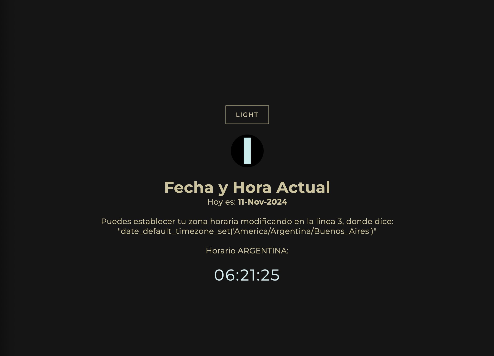

# PERSONAL_DIA_Y_FECHA
## Mostrar Dia y Fecha en PHP

# Proyecto de Fecha y Hora con Modo Claro/Oscuro

Este proyecto es una aplicación simple desarrollada en **PHP**, **JavaScript**, **HTML** y **CSS**. Muestra el día, la hora y la fecha actuales, junto con un botón para alternar entre los modos claro y oscuro. Es ideal para quienes buscan una introducción práctica a PHP en combinación con tecnologías de frontend.

## Características

- **Fecha y Hora en Tiempo Real**: Visualización dinámica del día, la fecha y la hora.
- **Modo Claro/Oscuro**: Botón para cambiar entre temas de color claro y oscuro, mejorando la accesibilidad y personalización de la interfaz.
  
## Tecnologías Utilizadas

- **PHP**: Procesamiento en el servidor para obtener la fecha y hora inicial.
- **JavaScript**: Lógica en el cliente para actualizar la fecha y la hora en tiempo real y gestionar el modo claro/oscuro.
- **HTML5**: Estructura de la aplicación.
- **CSS3**: Estilos para los modos claro y oscuro.

## Instalación

1. Clona este repositorio en tu equipo:
   ```bash
   git clone https://github.com/tu_usuario/proyecto-fecha-hora-php.git

## Captura


